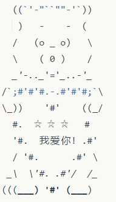

# &-nbsp 和 普通空格的区别

名字是长了一点，其实要讨论的就是如下2个问题

1. `&nbsp;` 和普通空格的区别；
2. 不同的“空格”和 `word-break` `word-wrap` `white-space`  属性如何配合；

## `&nbsp;` 和普通空格的区别

### 普通空格

在 HTML 中，W3C 对于普通空格的规定是：默认情况下，[多个“非空白字符之间的空格”在浏览器中会被压缩为一个空格显示]((https://www.w3.org/TR/REC-html40/struct/text.html#h-9.1))。如下代码示例效果（[点击查看效果]((https://codepen.io/yukap6/pen/WLbJjq))）

```
// html
<div id="outer">
  <div id="inner">start
    你好<span id="span">   中间文本 </span>世界
  </div>
</div>

// css
#outer {
  background-color: #ccc;
}
#span {
  color: #f60;
}
```

效果如下图


*如上所示，`start` 和 `你好` 之间的多个空格被压缩为了一个空格，符合规范。*

这里其实还有2个有意思的小点需要注意

1. 默认情况下，`#outer` 和 `#inner` div 脚本之间的大段空白以及为了排版的回车换行（也是属于空白符）是完全被忽略的；（原因是只有非空白字符之间的空白符会被压缩为一个空格显示，`#outer` 和 `#inner` 标签之间的空白符是没有被任何非空白字符包裹的）
2. `#span` 对应的橘色文字 `中间文本` 和围绕它的文本之间的空格是被保留了的；（原因是因为 `<span>` 这个行内元素里面的文本是被外面的非空白字符包裹了的，所以其空白字符被保留为一个来显示）

### `&nbsp;`

定义：nbsp 是 nonbreakable space 的缩写，从字面意思就可以理解， `&nbsp;` 是不可折断的空白字符，我们称之为空格的实体表示，也就是说 `&nbsp;` 本质是上是一个字符。

既然如此，和普通空格的区别就很明确了：`&nbsp;` 是字符，那么有多少个 `&nbsp;`，就会显示多少个空格，而不会出现浏览器的默认压缩和忽略问题。

## 空白字符和 `word-break` `word-wrap` `white-space` 的配合使用

首先简单介绍下桃园三兄弟 `word-break` `word-wrap` `white-space`，详细分析可以参考 [文章1](https://www.zhangxinxu.com/wordpress/2015/11/diff-word-break-break-all-word-wrap-break-word/)，[文章2](http://www.alloyteam.com/2016/05/css-word-for-word-breaker-do-you-really-understand/)，白话总结就是：

* `word-break` 指定了怎样在单词内断行；
* `word-wrap` 指定当一个不能被分开的字符串太长而不能填充其包裹盒时，为防止其溢出，浏览器是否允许这样的单词中断换行；
* `white-space` 控制空白符的处理（为了扩展浏览器对空白符处理的局限性）；

这么讲可能不够明白，举个🌰就明白了（[点击查看示例](https://codepen.io/yukap6/pen/YdPvxb)）。

HTML 如下
```
<div class="question-box" ><div class="question-title" ><span class="question-number" ><span >1</span><span >.</span></span><span class="question-type"><span > </span><span >[单选题]</span></span><span class="question-content-text" >Jin&nbsp;Yong，&nbsp;one&nbsp;of&nbsp;the&nbsp;most&nbsp;influential&nbsp;Chinese&nbsp;novelists，&nbsp;passed&nbsp;away&nbsp;on&nbsp;30th&nbsp;October，&nbsp;_______&nbsp;a&nbsp;great&nbsp;wave&nbsp;of&nbsp;reviewing&nbsp;of&nbsp;his&nbsp;classics．（　　）</span></div><div class="question-content" ></div></div>

<br />
<!-- 华丽的分割线 -->

<div class="question-box good" ><div class="question-title" ><span class="question-number" ><span >2</span><span >.</span></span><span class="question-type"><span > </span><span >[单选题]</span></span><span class="question-content-text" >Jin&nbsp;Yong，&nbsp;one&nbsp;of&nbsp;the&nbsp;most&nbsp;influential&nbsp;Chinese&nbsp;novelists，&nbsp;passed&nbsp;away&nbsp;on&nbsp;30th&nbsp;October，&nbsp;_______&nbsp;a&nbsp;great&nbsp;wave&nbsp;of&nbsp;reviewing&nbsp;of&nbsp;his&nbsp;classics．（　　）</span></div><div class="question-content" ></div></div>

<br />
<!-- 华丽的分割线 -->

<div class="question-box" ><div class="question-title" ><span class="question-number" ><span >3</span><span >.</span></span><span class="question-type" ><span > </span><span >[单选题]</span></span><span class="question-content-text" >"Jin    Yong， one of the most influential Chinese novelists， passed away on 30th October， _______ a great wave of reviewing of his classics．（　　）</span></div><div class="question-content" ></div></div>
```

CSS 如下
```
.question-box {
  width: 500px;
  overflow: hidden;
}
.question-type {
  color: #f60;
}
.good {
  white-space: pre-wrap;
  word-break: break-word;
  word-wrap: break-word;
}
```

效果如下截图


如上示例中，三组代码（用 `<!-- 华丽的分割线 -->` 分隔）效果各不相同，效果1、效果2都有问题，效果3才是我们的理想效果，接下来就分析下为什么会出现这些不同的表现呢？

效果1中，源代码里的英文单词是用 `&nbsp;` 分割并连接成长句的，没有设置任何换行控制，即采用浏览器的默认换行策略，结果是整个英文句子表现的像一个长单词不能被折断的情况一样，溢出了外部容器。这里的原因是默认情况下，浏览器会寻找可能换行的地方，但是在效果1的情况下，整个句子都是正常字符（`&nbsp;` 也是作为字符对待的），所有的字符组成了一个实际意义上的'长单词'，而且没有任何可以 'soft wrap' 的位置，其结果就是作为一个整体溢出了容器。

效果2中，因为设置了换行规则如下
```
.good {
  white-space: pre-wrap;
  word-break: break-word;
  word-wrap: break-word;
}
```


上面的规则意思是在单词内部可能折断（`word-break: break-word`）; 当内容溢出容器且找不到可以正常换行的位置时可以对单词进行折断（`word-wrap: break-word`）; 所有的空白字符保留且可以正常换行（`white-space: pre-wrap`）。所以就出现了单词 `away` 被强制折断换行的效果了。

效果3正常显示，因为大家会发现英文单词之间是正常空格连接的，而不是 `&nbsp;`。因为正常的空格属于可正常换行位置，所以当浏览器发现内容溢出了外部容器的时候，在恰当的位置（空白符位置）进行了换行（soft wrap），文本可以正常显示为一行而无诡异折行，也没有单词的强制折断。

解决方案找到，如果遇到 `&nbsp;` 连接的英文长句导致显示异常，可以先正则匹配将 `&nbsp;` 替换为正常空格后再渲染即可，正则提供如下

```
const replaceNbspToSpace = (str = '') => str.replace(/&nbsp;/g, ' ');
```

OK，那么终极考验来了，如果遇到富文本编辑后的代码，就是用 `&nbsp;` 来表示空格的，要怎么处理才能让文本正常显示呢？比如用户编辑了一个字符画如下



这时候简单的将 `&nbsp;` 替换为普通空格之后就会发现字符画的排版会完全乱掉，这是因为字符画里的多个 `&nbsp;` 被替换为普通空格之后，在浏览器端显示的时候会被压缩为一个空格来显示。怎么解决呢？方案也很简单，那就是改掉浏览器对空格的默认处理即可，保留所有空格并显示，添加如下样式即可。

```
white-space: pre-wrap;
```

pre 是 preserve 的缩写表示保留，`pre-wrap` 即保留白字符并显示，然后在可以换行的位置进行正常换行（当然如果要完全保留空白字符且不允许默认换行规则的话，可以设置为 `white-space: pre;` 即可）。

（完）

参考链接

* https://www.zhangxinxu.com/wordpress/2015/11/diff-word-break-break-all-word-wrap-break-word/
* http://www.ruanyifeng.com/blog/2018/07/white-space.html
* http://www.alloyteam.com/2016/05/css-word-for-word-breaker-do-you-really-understand/
* https://www.w3.org/TR/REC-html40/struct/text.html#h-9.1
* https://drafts.csswg.org/css-text-3/#word-break
